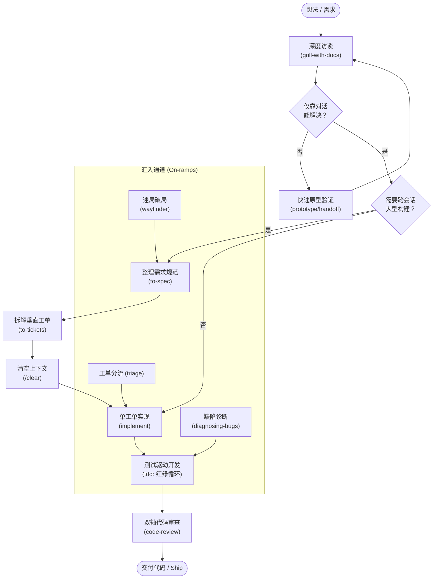

# 01. Ask Matt（技能全景路由与阶段边界）

> 你不可能记住每一个 skill，所以在不确定时直接来问。  
> 一个 **flow（工作流）** 是穿越各个 skill 的一条完整执行路径。大部分日常开发都沿着一条 **主流程（main flow）** 推进，并有两条 **汇入通道（on-ramps）** 会并入主流程。其余的 skill 要么是独立使用的（standalone），要么是在底层支撑的词汇与概念层（vocabulary layer）。

---

## 主流程：从构思到交付（The main flow: idea → ship）

下图是技能全景主流程与汇入通道的总览：



绝大多数工作所走的标准路线：你有一个想法，想把它做出来。

1. **`/grill-with-docs`** — 通过深度访谈打磨想法。只要你在一个具体的项目目录（working directory）下工作，就从这里开始：它是有状态的，会把访谈中梳理出的认知沉淀在 `CONTEXT.md` 和架构决策记录（ADRs）中。（如果没有代码仓库或工作目录？那就用 `/grill-me` —— 详见后文 Standalone。两者底层运行的是同一个 `/grilling` 访谈内核；但 `grill-with-docs` 会在本地留下文档记录，因此在有代码仓库时，它是绝对更优的选择。）
2. **分支判断 — 所有问题都能光靠对话解决吗？**  
   如果某个问题需要一个可运行的代码验证才能得出结论（比如复杂状态流转、核心业务逻辑、或者必须亲眼看到效果的 UI 界面），那就需要绕道做一个原型（prototype），并通过 **`/handoff`** 在两个方向之间架起桥梁（原型拥有自己独立的目录，而这正是 `/handoff` 的用武之地 —— 详见 Phase boundaries 章节）：
   - 用 **`/handoff`** 把当前上下文导出，针对该原型文件开启全新的会话；
   - 用 **`/prototype`** 编写可随时丢弃的验证代码来回答悬而未决的问题；
   - 用 **`/handoff`** 把验证得出的结论带回主对话，并在最初的想法讨论串中建立引用。
3. **分支判断 — 这是一次需要跨多次会话（multi-session）的大型构建吗？**
   - **是** → 使用 **`/to-spec`**（将整个讨论串整理归纳为需求规范文档），然后用 **`/to-tickets`** 将其拆解为一组纵深穿透的工单（tracer-bullet tickets，端到端垂直切片），每个工单明确声明自己的阻塞前置依赖（**blocking edges**）。如果使用本地简易跟踪器，就是在 `.scratch/<feature>/issues/` 目录下每个工单生成一个独立 Markdown 文件，按前置依赖顺序手动推进；如果接入真实工单系统（如 GitHub Issues / Linear），这些依赖就会变成系统原生的 blocking 关联，这样只要某个工单的前置依赖全部完成，就能随时拉取该工单 —— 为每个工单启动一次 **`/implement`**，并在工单切换之间清空上下文窗口（**`/clear`**）。每个工单都是自包含的，因此前一个工单的会话上下文完全可以丢弃。
   - **否** → 直接在当前的同一个上下文窗口中执行 **`/implement`**。

   无论选择哪条分支，**`/implement`** 内部都是通过驱动 **`/tdd`**（测试驱动开发）来逐步构建每个 issue —— 一次推进一个“红-绿”测试切片 —— 并在提交代码前，通过运行 **`/code-review`** 对变更 diff 进行双轴代码审查（编码规范 Standards + 需求契合度 Spec）。  
   当你不需要完整需求规范、只想先写测试来开发某个具体行为时，可以直接单独使用 **`/tdd`**；当你想针对某个固定的分支、PR 或基准点做代码审查时，可以直接单独使用 **`/code-review`**。

### 上下文保洁（Context hygiene）

在步骤 1 到 3 之间，请保持在 **同一个连贯不间断的上下文窗口** 中 —— 在执行完 `/to-tickets` 之前不要使用 compact（压缩）或 clear（清空）—— 这样深度访谈（grilling）、需求规范（spec）和工单拆解（tickets）都能基于完全同一套思考脉络进行。随后的每一个 `/implement` 任务则从对应工单出发，以全新的空白上下文独立开始。

这套流程的上限取决于模型的 **[Smart Zone（模型高效推理区间）](https://www.aihero.dev/ai-coding-dictionary/smart-zone)**：也就是先进大模型仍然能保持敏锐严密逻辑推理能力的上下文窗口范围（在顶尖模型上通常约为 150k tokens）。如果在进行到 `/to-tickets` 之前上下文就已经逼近这个上限，切勿在模型认知能力已经降级的情况下硬撑 —— 在最近的阶段边界（phase boundary）处执行 `/compact`，然后继续进行（详见 Phase boundaries）。

---

## 汇入通道（On-ramps）

代表那些会产生工作任务、并最终汇入主流程的起始场景：

- **Bugs 与需求堆积如山** → **`/triage`**（分类与分流）。它通过多角色流转梳理待办，产出适合 Agent 独立接手执行的工单（agent-ready issues），后续由 **`/implement`** 接手。  
  *注意*：Triage **仅用于处理那些你没有亲自创建的原始输入**（如外部 Bug 报告、新收到的功能建议等未加工事项）。由 `/to-tickets` 拆解产出的工单本身在结构上就已经达到了 agent-ready 标准，**千万不要对其再次执行 triage**。

- **东西坏了 / 故障排查** → **`/diagnosing-bugs`**。专治疑难杂症：那些第一眼看不出原因的 Bug、偶发性不稳定的 Flake、或者在两个已知正常版本之间悄然潜入的回归问题。在构建出 **快速精准的反馈闭环（tight feedback loop）**（即能稳定复现并在这特定 Bug 上必然报错的一行命令）之前，它严禁凭空猜想；一旦抓到复现闭环，就用回归测试锁定并修复。如果在事后复盘（post-mortem）中发现根本原因在于架构上缺乏良好的接缝（seam）来锁死 Bug，它会交接给 **`/improve-codebase-architecture`**。

- **巨大且前路迷茫的大型工程（全新从零项目或单次会话装不下的超大功能）** → **`/wayfinder`**（这是整套体系中认知负荷最大的工作流）。当从当前位置到最终目标的路径尚不可见时，它会在工单系统上绘制一张 **决策工单共享地图（shared map）**，逐一攻克这些决策工单 —— 产出的是 **明确的决策，而不是具体交付物** —— 直到迷雾散去、道路清晰。  
  对比来看：`/grill-with-docs` 磨练的是单次会话就能消化的小中型想法，而 wayfinder 则是为了解决单次会话容纳不下的庞大工程 —— 它的推进速度更慢、信息密度更高，因此请务必仅在真正迷茫的大型场景中使用，绝不要用在边界清晰的小需求上。

  当迷雾地图清晰之后：**它负责交接，而不直接做构建**。在 **`/to-spec`** 处汇入主流程，将地图中相互关联的决策收拢压缩为一份可执行计划，然后像往常一样走 `/to-tickets` 和 `/implement`。如果跳过这个压缩步骤、直接把整个大地图循环丢给 `/implement`，会丢失关联的决策细节 —— 只有当最初以为很宏大的工程最终发现其实非常简单微小时，才可以跳过收拢直接进入 `/implement`。

---

## 代码库健康维护（Codebase health）

不属于业务功能开发，而是代码库的日常保养与架构维护：

- **`/improve-codebase-architecture`** — 只要你有闲暇时间就可以运行它，让代码库始终保持适合 AI Agent 操作的良好状态。它会主动扫描并揭示 **加深模块内聚的机会（deepening opportunities）**；选定一个优化点后，就会生成一个明确的想法，你可以把这个想法带入主流程的 `/grill-with-docs` 展开。它是负责全面勘测、寻找优化候选点的扫描仪；而下方的 **`/codebase-design`** 则是你用来精细设计被选定模块的工作台。

---

## 底层词汇与设计语言（Vocabulary underneath）

两个由模型调用的底层参考指南（model-invoked references），运行在其他所有 skills *之下* —— 它们各自是所属词汇领域的单一权威真相源。当你在 **词汇概念** 层面遇到困惑而非流程层面卡壳时，可以直接查阅它们；上层 skills 也会在需要时自动调用它们：

- **`/domain-modeling`（领域建模）** — 磨练并澄清项目的领域语言：质疑模糊不清的概念、厘清职责过载的术语（例如一个叫 "account" 的词同时承担三种不同角色的职责）、并将难以逆转的核心决策记录为 ADR。这是 `/grill-with-docs` 背后驱动的积极纪律，目的是让 `CONTEXT.md` 保持为一份清晰无歧义的词汇表。
- **`/codebase-design`（代码库设计）** — 专注于“深模块”（deep module）的设计词汇（包括 module 模块、interface 接口、depth 深度、seam 架构接缝、adapter 适配器、leverage 杠杆率、locality 局部性），用于设计模块的形态：在干净整洁的接缝处，用极简小巧的对外接口承载大量丰富的内部行为。`/tdd` 和 `/improve-codebase-architecture` 底层都在使用这套语言体系。

---

## 阶段边界抉择（Phase boundaries）

一个 **阶段（phase）** 是指单次会话中的一块独立工作单元 —— 例如需求访谈、具体实现、测试验收等。在两个阶段的 **边界（boundary）** 处，你面临五个选项，而在这五者之间做选择是整张路线图中最需要权衡的决策：

- **Continue（继续当前会话）** — 留在原处。零切换成本，不丢失任何上下文。
- **`/clear`（清空上下文）** — 完全清空窗口，适用于当前会话中的讨论与后续步骤毫无关联的情况。
- **`/handoff`（交接导出）** — 生成一份独立便携的 Markdown 文件。适用场景很狭窄：仅用于 **更换测试套件（new harness）**、**切换到新目录**、**转交给人类同事**、或在 **阶段中途分叉出一个侧面子任务**。它带来的核心价值是“可移植性与跨环境传递”。
- **Subagent（分发子代理）** — 将一个边界明确、目标高度聚焦的任务派发到其独立的子窗口中执行，并在完成后将结果汇报回来。
- **`/compact`（上下文压缩）** — 对当前上下文进行摘要压缩，并以此作为种子开启一个全新的会话。这是 **默认的备选兜底方案**，位于决策树的最底部，而不是第一优先级。

阅读 [PHASE-BOUNDARIES.md](./01-ask-matt_PHASE-BOUNDARIES.md) 了解严格排序的决策树 —— 其中的五个核心问题、每个分支背后的权衡逻辑，以及为什么由于原始一手上下文（primary-source）的丢失代价，必须首先排除掉 **Continue** 的可能性才考虑其他选项。请务必在 **阶段的边界处** 做出决策；如果在阶段进行中途，要么继续（continue），要么把剩余工作拆分子代理。

---

## 独立技能（Standalone）

完全脱离主流程的独立工具：

- **`/grill-me`** — 与 `/grill-with-docs` 采用同样严格透彻的深度访谈，但它是 **无状态的（stateless）**：不会在本地保存任何文件，也不会建立 `CONTEXT.md`。当你 **不在一个具体的项目代码仓库中工作时** 使用（例如打磨构思、打磨设计方案、打磨一篇文章，或任何没有底层代码库支撑的事物）。如果你已经在代码仓库中，请改用 `/grill-with-docs`：两者执行完全相同的深度访谈，但后者会留下文档记录，因此在有代码仓库时，它是绝对更优的选择。
- **`/grilling`** — 深度访谈算法原语本身：按轮次推进（rounds）、只询问当前依赖已解决的前沿问题（frontier）、明确分工（查询事实是 Agent 的职责，做出价值决策是用户的权利）。`/grill-me` 与 `/grill-with-docs` 是它的两个具名入口，而 `/triage`、`/wayfinder` 和 `/improve-codebase-architecture` 内部也都在运行它。只有当你想要一个完全没有外层包装的纯粹访谈时，才直接使用它。
- **`/resolving-merge-conflicts`** — 逐个冲突块解决进行中的 merge 或 rebase 冲突，通过溯源双方的原始意图（primary source）而非机械挑拣代码行来化解分歧，并最终完成合并操作。它绝不会执行 `--abort`。独立于所有主流程：仅在已经陷入代码冲突时使用。
- **`/prototype`** — 编写小型、可丢弃的探针程序来回答某个具体的设计疑问：例如“这种状态模型感觉对不对？”或者“这个 UI 界面应该长什么样？”。所谓“可丢弃（Throwaway）”是对代码编写方式的一种约束（不必写完备测试或过度抽象），而不是承诺必须将代码彻底销毁：探索出的答案会被提炼融入正式代码，而原型代码本身会作为一手参考材料保留在基于 main 分支拉出的 `prototype/<name>` 分支上，并在对应的实现工单中予以链接。它是主流程第 2 步中的绕道分支，但在任何纸面上难以确定的设计问题面前，都可以随时调出它。
- **`/research`** — 将文献阅读和资料调研的繁重工作委派给 **后台 Agent**：它会对照一手权威资料（primary sources）深入调研一个问题，并在代码库中留下一份带有引用出处的 Markdown 笔记。在它查阅资料的同时，你可以继续进行其他工作。它产出的文件后续可以直接带入主流程的 `/grill-with-docs` 中 —— 调研是为了辅助思考，而不是取代思考。
- **`/to-questionnaire`** — 当阻碍你前进的认知不在你自己脑子里、也不在代码库中，而在 **他人脑海中** 时，使用此 skill 为对方生成一份可以直接填写的问卷。它是 `/grill-me` 的逆向操作：不是就主题本身盘问你，而是就 **发出问卷这件事本身** 盘问你 —— 问卷要发给谁、你期望拿回什么信息 —— 从而把问题精准对准认知缺口。回收的内容就是后续走 `/grill-with-docs` 或 `/to-spec` 的绝佳输入。
- **`/wizard`** — 专门处理那些只有 **人类** 才能完成的操作步骤：例如开通云基础设施、配置敏感凭证或 CI 密钥、在陌生的第三方控制面板中点击配置、运行一次性数据迁移或上线割接。它会生成一个交互式 bash 脚本，引导人类逐一打开对应 URL、捕获配置的值，并自动写入 `.env` 和 GitHub Secrets —— 这样你就不必每次都要向 Agent 重新解释一遍这些人工流程。这是由模型自主调用的（Model-invoked），当 Agent 碰上只有人类才能越过的障碍时会自动调起它。如果 Agent 自己就能搞定，它就应该自己做；此工具专门用于必须有人类在环的场景。
- **`/wait-what`** — 当 Agent 的某条表达没能说清楚、导致沟通脱节时的即时纠偏工具。在任何其他 skill 的对话中途均可触发，Agent 会用大白话结合 `CONTEXT.md` 中的既有词汇，把刚才所说内容结合你所缺失的背景重新阐述一遍。这是一种事后补救；而 `/grill-with-docs` 则是事前预防，因为早期统一的领域语言从源头上就杜绝了黑话黑词的出现。
- **`/teach`** — 跨多次会话学习某个概念，将当前目录作为有状态的工作空间。
- **`/writing-for-agents`** — 为编写供 Agent 消费阅读的文档提供核心参考指南（包括 skills 编写、AGENTS.md、以及各类指针引用的文档）。

---

## 前置条件（Precondition）

- **`/setup-matt-pocock-skills`** — 在开始第一次工程工作流之前运行，用于配置其他 skills 默认依赖的工单跟踪系统、分类标签以及文档结构布局。也支持自定义的工单跟踪系统。详见 [02. setup-matt-pocock-skills](./02-setup-matt-pocock-skills.md)。

---

## 📑 附录：技能元信息与英文原文

### 📌 元数据（Meta）

| 字段 | 说明 |
|---|---|
| **Skill 名称** | `ask-matt` |
| **所属分类（Bucket）** | `engineering` |
| **上游路径** | [`skills/engineering/ask-matt/`](https://github.com/mattpocock/skills/tree/main/skills/engineering/ask-matt) |
| **触发机制** | `disable-model-invocation: true`（用户主动咨询调用） |
| **附属伴侣文档** | [PHASE-BOUNDARIES.md](./01-ask-matt_PHASE-BOUNDARIES.md)（阶段边界决策树与上下文管理哲学） |

<br>

<details>
<summary><b>📄 点击展开查看英文原文 (SKILL.md / 原版可直接复制)</b></summary>

```markdown
---
name: ask-matt
description: Ask which skill or flow fits your situation. A router over the skills in this repo.
disable-model-invocation: true
---

# Ask Matt

You don't remember every skill, so ask.

A **flow** is a path through the skills. Most paths run along one **main flow**, and two **on-ramps** merge onto it. Everything else is standalone, or a vocabulary layer that runs underneath.

## The main flow: idea → ship

The route most work travels. You have an idea and want it built.

1. **`/grill-with-docs`** — sharpen the idea by interview. Start here whenever you are **working in a working directory**: it's stateful, retaining what it learns in `CONTEXT.md` and ADRs. (No working directory? Use `/grill-me` — see Standalone. Both run the same `/grilling` primitive; `grill-with-docs` is the one that leaves a paper trail, which makes it the better of the two whenever a repo is there to leave it in.)
2. **Branch — can you settle every question in conversation?** If a question needs a runnable answer (state, business logic, a UI you have to see), detour through a prototype, bridged by **`/handoff`** in both directions (a prototype lives in its own directory, which is exactly what `/handoff` is for — see Phase boundaries):
   - **`/handoff`** out, then open a fresh session against that file,
   - **`/prototype`** to answer the question with throwaway code,
   - **`/handoff`** back what you learned, and reference it from the original idea thread.
3. **Branch — is this a multi-session build?**
   - **Yes** → **`/to-spec`** (turn the thread into a spec), then **`/to-tickets`** to split it into tracer-bullet tickets, each declaring its **blocking edges**. On a local tracker that's one file per ticket under `.scratch/<feature>/issues/`, worked blockers-first by hand; on a real tracker the edges become native blocking links, so any ticket whose blockers are done can be grabbed — kick off **`/implement`** per ticket, **`/clear`ing context between each one**. Each ticket is self-contained, so the last one's context is disposable.
   - **No** → **`/implement`** right here, in the same context window.

   Either way, **`/implement`** builds each issue by driving **`/tdd`** internally — one red-green slice at a time — then closes out by running **`/code-review`**, a two-axis review (Standards + Spec) of the diff, before committing. Reach for **`/tdd`** on its own when you just want to build a concrete behaviour test-first without a full spec, and **`/code-review`** on its own whenever you want to review a branch or PR against a fixed point.

### Context hygiene

Keep steps 1–3 in **one unbroken context window** — don't compact or clear until after `/to-tickets` — so the grilling, spec, and tickets all build on the same thinking. Each `/implement` then starts fresh, working from the ticket.

The limit on this is the **[smart zone](https://www.aihero.dev/ai-coding-dictionary/smart-zone)**: the window (~150k tokens on state-of-the-art models) within which the model still reasons sharply. If a session approaches it before `/to-tickets`, don't push on degraded — `/compact` at the nearest phase boundary and carry on (see Phase boundaries).

## On-ramps

A starting situation that generates work, then merges onto the main flow.

- **Bugs and requests piling up** → **`/triage`**. It moves issues through triage roles and produces agent-ready issues, which **`/implement`** later picks up.

  Triage is only for issues **you didn't create** — bug reports, incoming feature requests, anything that arrives raw. Tickets that `/to-tickets` produced are already agent-ready, so **don't triage them**.

- **Something's broken** → **`/diagnosing-bugs`**. For the hard ones: the bug that resists a first glance, the intermittent flake, the regression that crept in between two known-good states. It refuses to theorise until it has a **tight feedback loop** — one command that already goes red on *this* bug — then fixes with a regression test. Its post-mortem hands off to **`/improve-codebase-architecture`** when the real finding is that there's no good seam to lock the bug down.

- **A huge, foggy effort — a greenfield project or a huge feature build, too big for one session** → **`/wayfinder`**, the most cognitively demanding flow here. When the way from here to the destination isn't visible yet, it charts a **shared map** of **decision tickets** on the issue tracker and resolves them one at a time — producing **decisions, not deliverables** — until the fog is pushed back and the way is clear. Where **`/grill-with-docs`** sharpens an idea you can hold in one session, wayfinder is for the idea you can't — and it's slower and denser, so save it for exactly that, never a well-scoped feature.

  When the map clears, **it hands off, it doesn't build**: merge onto the main flow at **`/to-spec`**, which collapses the map's linked decisions into a buildable plan, then `/to-tickets` and `/implement` as usual. Looping the map straight into `/implement` skips that collapse and throws the linked detail away — go straight to `/implement` only when the effort turned out genuinely small.

## Codebase health

Not feature work — upkeep.

- **`/improve-codebase-architecture`** — run whenever you have a spare moment to keep the codebase good for agents to operate in. It surfaces **deepening opportunities**; picking one _generates an idea_ you can take into the main flow at `/grill-with-docs`. It's the survey that finds the candidates; **`/codebase-design`** (below) is the bench you design the chosen one on.

## Vocabulary underneath

Two model-invoked references that run *beneath* the other skills — each the single source of truth for its vocabulary. Reach for them directly when the **words**, not the process, are the problem; or let the skills above pull them in.

- **`/domain-modeling`** — sharpen the project's *domain* language: challenge a fuzzy term, resolve an overloaded word ("account" doing three jobs), record a hard-to-reverse decision as an ADR. It's the active discipline `/grill-with-docs` drives to keep `CONTEXT.md` a clean glossary.
- **`/codebase-design`** — the deep-module vocabulary (module, interface, depth, seam, adapter, leverage, locality) for designing a module's *shape*: a lot of behaviour behind a small interface at a clean seam. `/tdd` and `/improve-codebase-architecture` both speak it.

## Phase boundaries

A **phase** is a chunk of work inside a session — the grilling, the implementation, the QA. At the **boundary** between two of them you have five options, and picking between them is the fuzziest decision in this whole map:

- **Continue** — stay put. Costs nothing, loses nothing.
- **`/clear`** — empty the window, when nothing here matters to what's next.
- **`/handoff`** — write a portable markdown file. Narrow: only for a **new harness**, a **new directory**, a **colleague**, or forking a side task **mid-phase**. What it buys is portability.
- **Subagent** — send a tightly-scoped task to its own window and get a report back.
- **`/compact`** — compress this context and seed a fresh session with it. The **default**, at the bottom of the tree rather than the first reach.

Read [PHASE-BOUNDARIES.md](./01-ask-matt_PHASE-BOUNDARIES.md) for the ordered tree — the five questions, the reasoning behind each branch, and why the primary-source cost makes **Continue** the one to rule out first. Make the decision **at** a boundary; mid-phase, continue or split the rest into subagents.

## Standalone

Off the main flow entirely.

- **`/grill-me`** — the same relentless interview as `/grill-with-docs`, but **stateless**: it saves nothing locally and builds no `CONTEXT.md`. Reach for it when you are **not working in a working directory** — sharpening a plan, a design, a piece of writing, anything with no repo under it. If you are in a working directory, use `/grill-with-docs` instead: it runs the same interview and leaves a paper trail, so it is strictly the better one.
- **`/grilling`** — the interview primitive itself: rounds, the frontier, facts are the agent's job and decisions are yours. `/grill-me` and `/grill-with-docs` are the two named ways in, and `/triage`, `/wayfinder` and `/improve-codebase-architecture` all run it internally. Reach for it directly only when you want the interview with no wrapper around it.
- **`/resolving-merge-conflicts`** — work an in-progress merge or rebase conflict hunk by hunk, resolving by **intent** traced to each side's primary source rather than by picking lines, then finish the operation. It never runs `--abort`. Standalone and off every flow: reach for it when you are already mid-conflict.
- **`/prototype`** — a small, throwaway program that answers one design question: does this state model feel right, or what should this UI look like. Throwaway is a constraint on how the code is written, not a promise to destroy it: the answer folds into the real code, and the prototype itself is kept as a **primary source** on a `prototype/<name>` branch out of main, pointed at from the implementation issue. It's the detour in step 2 of the main flow, but reach for it any time a design question is hard to settle on paper.
- **`/research`** — delegate reading legwork to a **background agent**: it investigates a question against **primary sources**, then leaves a cited Markdown file in the repo. Keep working while it reads. The file it produces is something to take *into* the main flow at `/grill-with-docs` — research feeds the thinking, it doesn't replace it.
- **`/to-questionnaire`** — when the thing blocking you isn't in your head or the codebase but in **someone else's**, this writes them a questionnaire to fill in. It's the inverse of `/grill-me`: instead of interviewing you about the subject, it interviews you about the **send** — who it's going to, what you need back — and aims the questions at the gap. What comes back is material for `/grill-with-docs` or `/to-spec`.
- **`/wizard`** — for the steps only a **human** can take: provisioning infrastructure, setting up credentials or CI secrets, clicking through an unfamiliar third-party dashboard, running a one-off migration or cutover. It generates an interactive bash script that opens each URL, captures each value, and writes it into `.env` and GitHub secrets — so the procedure stops being something you re-explain to an agent every time. Model-invoked, so the agent reaches for it the moment it hits a wall only you can pass. If the agent could just do it itself, it should; this is for where a human is genuinely in the loop.
- **`/wait-what`** — the corrective for a message that didn't land. Use it mid-conversation, inside any other skill, and the agent re-pitches what it just said with the context you were missing, in plain English, using the `CONTEXT.md` vocabulary. It works after the fact; `/grill-with-docs` is the upfront cure, because a shared language agreed early is what stops the jargon arriving at all.
- **`/teach`** — learn a concept over multiple sessions, using the current directory as a stateful workspace.
- **`/writing-for-agents`** — reference for writing documents agents consume: skills, AGENTS.md, pointed-at docs.

## Precondition

**`/setup-matt-pocock-skills`** — run before your first engineering flow to configure the issue tracker, triage labels, and doc layout the other skills assume. Custom issue trackers also work.
```

</details>
