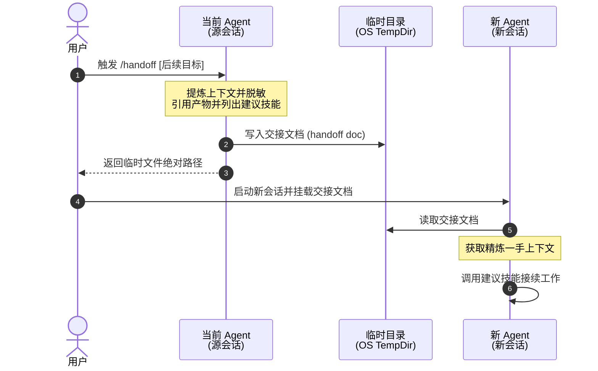

# 06. handoff（handoff（跨会话交接导出））

```yaml
name: handoff
description: 将当前对话内容压缩提炼为一份交接文档（handoff document），供新的 Agent 或会话无缝接手。
argument-hint: "下一个会话将用于什么任务？"
disable-model-invocation: true
```

下图是跨会话/跨环境交接（Handoff）的流转时序总览：



编写一份交接文档，系统总结当前会话的上下文与进展，以便全新的 Agent 能够直接接续工作。**将其保存到用户操作系统的临时目录（temp directory）中，而不是当前的工作区代码目录内**。

文档中必须包含一个 **"建议调用的技能（suggested skills）"** 章节，明确指出接手工作的 Agent 接下来应该调用哪些 skills。

**不要重复搬运已经记录在其他产物中的内容**（例如已有的 specs 需求规范、plans 计划、ADRs 架构决策记录、工单 issues、提交记录 commits 或代码 diffs）。请直接使用文件路径或 URL 链接来引用它们。

**对所有敏感信息进行脱敏处理**，例如 API 密钥、密码或个人身份隐私信息。

如果用户在调用时传入了参数，将其作为下一个会话的核心关注点描述，并据此针对性地剪裁和定制交接文档的内容。

---

## 📑 附录：技能元信息与英文原文

### 📌 元数据（Meta）

- bucket: `productivity`
- path: `skills/productivity/handoff/`
- upstream: https://github.com/mattpocock/skills/tree/main/skills/productivity/handoff
- 触发方式：`disable-model-invocation: true` → **user-invoked only**；带 `argument-hint: "What will the next session be used for?"`
- companion 文件：
  - `agents/openai.yaml`

<br>

<details>
<summary><b>📄 点击展开查看英文原文 (原版可直接复制)</b></summary>

```markdown
---
name: handoff
description: Compact the current conversation into a handoff document for another agent to pick up.
argument-hint: "What will the next session be used for?"
disable-model-invocation: true
---

Write a handoff document summarising the current conversation so a fresh agent can continue the work. Save to the temporary directory of the user's OS - not the current workspace.

Include a "suggested skills" section in the document, which suggests skills that the agent should invoke.

Do not duplicate content already captured in other artifacts (specs, plans, ADRs, issues, commits, diffs). Reference them by path or URL instead.

Redact any sensitive information, such as API keys, passwords, or personally identifiable information.

If the user passed arguments, treat them as a description of what the next session will focus on and tailor the doc accordingly.
```

</details>
