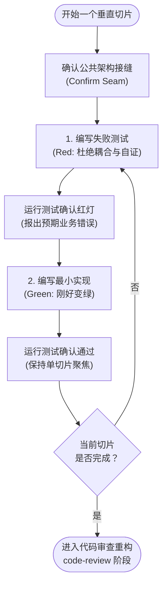

# 09. tdd（Test-Driven Development（测试驱动开发））

TDD 是由“红（失败）→ 绿（通过）”构成的迭代循环。本 skill 是指导该循环产出“真正值得长期保留的测试”的权威参考：明确什么是好测试、测试应该写在什么位置、防范哪些反模式、以及严格遵循的循环准则。其中的每一项准则都适用于每一次循环 —— 请在循环**之前**与**进行中**随时查阅，而不是事后才来翻看。

在探索代码库时，如果存在 `CONTEXT.md`，请务必阅读，以确保测试名称与接口词汇能够与项目的领域语言保持一致，并严格遵循所触及区域的架构决策记录（ADRs）。

## 什么是好测试

测试必须通过**对外公共接口（public interfaces）**来验证行为，而不是紧贴内部实现细节。内部代码可以被完全重构改写，但测试不应该跟着改。一个好的测试读起来应该像一份活的需求规范 —— 例如“在购物车有效时用户可以正常结账（user can checkout with valid cart）”能够精确传达系统具备何种能力 —— 并且在后续的代码重构中依然稳健存活，因为它的断言根本不关心内部的具体代码结构。

关于好坏测试的对比示例请参阅 [tests.md](./09-tdd_tests.md)，关于 Mock 使用边界的指南请参阅 [mocking.md](./09-tdd_mocking.md)。

## 架构接缝（Seams）—— 测试应当写在哪里

**接缝（Seam）** 是你进行测试的公共对外边界：也就是你能观察到系统外部行为而无需探入其内部实现细节的接口。测试必须编写在接缝上，绝不要面向内部私有实现。

**只在预先确认的接缝上编写测试**。在编写任何测试之前，必须先明确写出待测的接缝，并向用户确认。**绝不在未与用户确认的接缝上编写测试**。你不可能测试所有细节 —— 提前敲定接缝，才能把测试的精力聚焦在关键路径和复杂业务逻辑上，而不是浪费在每个细枝末节的极端情况上。

主动向用户询问：“当前的核心公共接口是什么？我们应该在哪些接缝上建立测试？”

当接口本身的结构存在争议时 —— 例如模块应该有多深、接缝到底该设在哪里、接口应该暴露哪些能力 —— 可以查阅 `/codebase-design` skill 的词汇体系。它是模块（module）、接口（interface）、深度（depth）、接缝（seam）、适配器（adapter）、杠杆率（leverage）和局部性（locality）等概念的权威定义来源；它是一份供随时查阅的参考，而不是需要独立运行的会话。

## 必须杜绝的反模式（Anti-patterns）

- **与实现细节强耦合（Implementation-coupled）**：Mock 内部协作对象、测试私有方法、或者通过旁门左道进行验证（例如不走接口而直接去查底层数据库）。典型特征：当你仅仅做了一次内部重构、外部行为完全没变时，测试却大面积报错挂掉。
- **同义反复 / 虚假自证（Tautological）**：断言计算预期值的方式与被测代码完全一样（例如 `expect(add(a, b)).toBe(a + b)`、手推得到的快照、或者断言某个常量等于它自己）。这种测试在结构上永远都是绿灯通过的，永远无法与代码产生真正的分歧。测试的期望值必须来自一个**独立的权威真相源** —— 例如已知正确的常量字面量、手工验证过的具体案例、或需求规范文档。
- **水平横切（Horizontal slicing）**：一次性把所有测试全部写完，再去写所有实现代码。批量先写测试验证的只是**脑补出来**的行为：你测试的只是事物的外部表象轮廓（shape），而非面向用户的真实行为；这会导致测试对真正的变化反应迟钝，并且在真正理解实现前就锁死了僵化的测试结构。必须改为 **垂直切片（vertical slices）** 推进 —— 写一个测试 → 写一段最小实现使其变绿 → 重复此过程；每一个测试都是一发**穿透示踪弹（tracer bullet）**，紧密响应上一个循环中学到的新认知。

## 循环的核心准则（Rules of the loop）

下图是 TDD 核心切片循环（Red-Green Loop）与边界约束的总览：



- **先红后绿（Red before green）**：必须先写出能够复现失败的测试（红），然后只写刚好足够让测试通过的最小代码（绿）。不要预先猜测未来的测试，也不要提前编写投机性的额外功能。
- **一次推进一个切片（One slice at a time）**：每个循环周期只聚焦一个接缝、一个测试、一次最小实现。
- **代码重构不属于本循环（Refactoring is not part of the loop）**：重构操作严格归属于后续的代码审查阶段（详见 `code-review` skill），绝不要塞进“红→绿”的实现开发循环内部。

## Companions 摘要（不全文）

### [tests.md](./09-tdd_tests.md) — Good and Bad Tests

- **好测试（integration-style）**：经 real interfaces 测可观察行为；公共 API；能在 internal refactor 后存活；描述 WHAT 不 HOW；每测一逻辑断言。例：`user can checkout with valid cart`。
- **坏：implementation-detail**：mock 内部 collaborator、测 call count/order、旁路查 DB。例：断言 `paymentService.process` 被调用 vs 经 `getUser` 验证 `createUser` 可检索。
- **坏：tautological**：`items.reduce` 算出 expected 再 `toBe(expected)`；应改用独立字面量 `toBe(15)`。

### [mocking.md](./09-tdd_mocking.md) — When to Mock

- **只在 system boundaries mock**：外部 API、（有时）DB、时间/随机、（有时）文件系统。
- **不 mock**：自己的 classes/modules、内部 collaborators、你控制的一切。
- **为可 mock 而设计**：DI 注入外部依赖；prefer SDK-style 接口（`getUser` / `getOrders`）而非通用 `fetch(endpoint)` —— 每 mock 返回一种 shape，测试 setup 无条件分支。

---

## 📑 附录：技能元信息与英文原文

### 📌 元数据（Meta）

| 字段 | 值 |
|---|---|
| bucket | `engineering/` |
| path | `skills/engineering/tdd/` |
| url | https://github.com/mattpocock/skills/tree/main/skills/engineering/tdd |
| name | `tdd` |
| 触发 | description：test-first 做功能或修 bug；用户提到 red-green-refactor 或要 integration tests |
| 调用策略 | 默认可被模型按 description 触发（无 `disable-model-invocation`） |
| companions | [tests.md](./09-tdd_tests.md)（好/坏测试示例）、[mocking.md](./09-tdd_mocking.md)（mock 边界与可 mock 设计）——本页只摘要，不全文翻译 |
| 相关 skill | `/codebase-design`（seam / module / depth 词表）；`/code-review`（refactor 归属 review 阶段，不在 red→green 循环内） |
| 下游消费者 | `/implement` 明确要求 “Use /tdd where possible, at pre-agreed seams” |

<br>

<details>
<summary><b>📄 点击展开查看英文原文 (原版可直接复制)</b></summary>

```markdown
---
name: tdd
description: Test-driven development. Use when the user wants to build features or fix bugs test-first, mentions "red-green-refactor", or wants integration tests.
---

# Test-Driven Development

TDD is the red → green loop. This skill is the reference that makes that loop produce tests worth keeping: what a good test is, where tests go, the anti-patterns, and the rules of the loop. Every section applies on every cycle — consult them before and during the loop, not after.

When exploring the codebase, read `CONTEXT.md` (if it exists) so test names and interface vocabulary match the project's domain language, and respect ADRs in the area you're touching.

## What a good test is

Tests verify behavior through public interfaces, not implementation details. Code can change entirely; tests shouldn't. A good test reads like a specification — "user can checkout with valid cart" tells you exactly what capability exists — and survives refactors because it doesn't care about internal structure.

See [tests.md](./09-tdd_tests.md) for examples and [mocking.md](./09-tdd_mocking.md) for mocking guidelines.

## Seams — where tests go

A **seam** is the public boundary you test at: the interface where you observe behavior without reaching inside. Tests live at seams, never against internals.

**Test only at pre-agreed seams.** Before writing any test, write down the seams under test and confirm them with the user. No test is written at an unconfirmed seam. You can't test everything — agreeing the seams up front is how testing effort lands on the critical paths and complex logic instead of every edge case.

Ask: "What's the public interface, and which seams should we test?"

When the shape of that interface is itself in question — how deep the module is, where the seam belongs, what the interface should expose — use the `/codebase-design` skill for the vocabulary. It is the shared source of the module, interface, depth, seam, adapter, leverage and locality terms, and it is a reference to consult, not a session to run.

## Anti-patterns

- **Implementation-coupled** — mocks internal collaborators, tests private methods, or verifies through a side channel (querying the database instead of using the interface). The tell: the test breaks when you refactor but behavior hasn't changed.
- **Tautological** — the assertion recomputes the expected value the way the code does (`expect(add(a, b)).toBe(a + b)`, a snapshot derived by hand the same way, a constant asserted equal to itself), so it passes by construction and can never disagree with the code. Expected values must come from an independent source of truth — a known-good literal, a worked example, the spec.
- **Horizontal slicing** — writing all tests first, then all implementation. Bulk tests verify _imagined_ behavior: you test the _shape_ of things rather than user-facing behavior, the tests go insensitive to real changes, and you commit to test structure before understanding the implementation. Work in **vertical slices** instead — one test → one implementation → repeat, each test a **tracer bullet** that responds to what the last cycle taught you.

## Rules of the loop

- **Red before green.** Write the failing test first, then only enough code to pass it. Don't anticipate future tests or add speculative features.
- **One slice at a time.** One seam, one test, one minimal implementation per cycle.
- **Refactoring is not part of the loop.** It belongs to the review stage (see the `code-review` skill), not the red → green implementation cycle.
```

</details>
