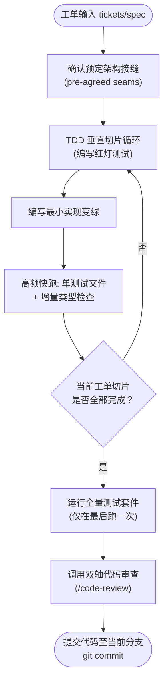

# 10. implement（implement（执行具体功能实现））

```yaml
name: implement
description: 基于需求规范（spec）或工单集合（tickets）实现具体的功能特性。
disable-model-invocation: true
```

根据用户在需求规范（spec）或工单（tickets）中所描述的内容实现具体工作。

下图是单工单实现（Implement）核心流程与测试审查闭环的总览：



在条件允许的情况下尽可能使用 `/tdd`（测试驱动开发），且严格仅在**预先达成一致的架构接缝（pre-agreed seams）**上进行。

开发期间频繁运行类型检查（typechecking），频繁运行关联的单个测试文件；而**全量测试套件（full test suite）只在最后全部完成后运行一次**。

一旦开发完成，调用 `/code-review` 对本次修改进行双轴代码审查。

最后将本次工作提交（commit）到当前分支。

---

## 📑 附录：技能元信息与英文原文

### 📌 元数据（Meta）

| 字段 | 值 |
|---|---|
| bucket | `engineering/` |
| path | `skills/engineering/implement/` |
| url | https://github.com/mattpocock/skills/tree/main/skills/engineering/implement |
| name | `implement` |
| 触发 | description：基于 spec 或 tickets 实现一块工作 |
| 调用策略 | `disable-model-invocation: true`（仅用户显式调用；`agents/openai.yaml` 中 `allow_implicit_invocation: false`） |
| companions | 无独立 companion 文件；流程上编排 `/tdd` 与 `/code-review` |
| 上游 | `/to-tickets` 产出、`/to-spec`、用户给出的 spec/tickets |
| 下游 | 完成后强制 `/code-review`；commit 到当前 branch |

<br>

<details>
<summary><b>📄 点击展开查看英文原文 (原版可直接复制)</b></summary>

```markdown
---
name: implement
description: "Implement a piece of work based on a spec or set of tickets."
disable-model-invocation: true
---

Implement the work described by the user in the spec or tickets.

Use /tdd where possible, at pre-agreed seams.

Run typechecking regularly, single test files regularly, and the full test suite once at the end.

Once done, use /code-review to review the work.

Commit your work to the current branch.
```

</details>
