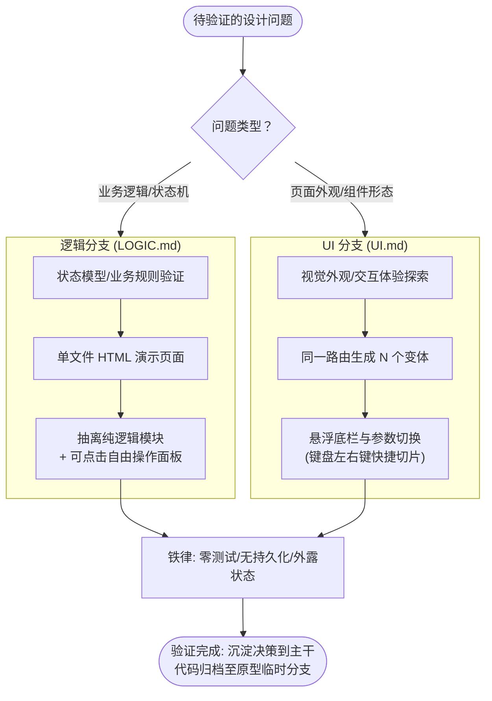

# 12. prototype（Prototype（用后即弃的原型验证））

```yaml
name: prototype
description: 编写一个用后即弃的原型（throwaway prototype）来回答具体的设计问题。当用户希望对状态模型或核心业务逻辑是否合理进行健全性检查，或探索 UI 界面应该呈现何种外观时使用。
```

原型本质上是 **“为了回答某一个具体问题而编写的用后即弃代码（throwaway code）”**。问题本身的性质决定了原型的形态。

## 选择分支方向

下图是原型验证（Prototype）分支选择与生命周期的总览：



明确当前究竟是要回答哪一类问题 —— 可以从用户的提示词、周边的上下文代码中判断，或者如果用户在线则直接询问：

- **“这种业务逻辑 / 状态模型感觉对不对？”** → 参阅 [LOGIC.md](./12-prototype_LOGIC.md)。构建一个单独且易于分享的 HTML 文件 —— 包含自由操作按钮与带标签的引导式分步演示 —— 将状态机推向在纸面上极难推演的复杂边界场景，且任何非技术人员都能轻松点击操作。
- **“这个界面应该长什么样？”** → 参阅 [UI.md](./12-prototype_UI.md)。在同一个路由上生成若干种**结构截然不同**的 UI 设计变体，并通过 URL 查询参数与一个悬浮在底部的切换栏在不同变体间自由切换。

这两个分支产出的产物形态截然不同 —— 如果选错分支，整个原型的开发精力就会被完全浪费。如果问题确实含糊不清且无法联系到用户，默认选择与周围代码更契合的分支（后端模块 → 逻辑分支；页面或组件 → UI 分支），并在原型的顶部明确注明该假设。

## 两条分支必须共同遵循的铁律

1. **从第一天起就是用后即弃的，并且必须明确标出**。将原型代码存放在紧邻它实际会被使用的地方（紧挨着它为其做原型的模块或页面），以便上下文一目了然 —— 但命名必须让任何读者一眼就能看出它是原型而非生产代码。对于用后即弃的 UI 路由，严格遵循项目既有的路由约定；不要凭空发明新的顶层结构。
2. **极简易启动（Trivial to run）**。UI 原型必须能通过项目任务运行器的一条命令直接启动（如 `pnpm <name>`、`python <path>`、`bun <path>` 等）。逻辑演示则是一个用户直接双击就能在浏览器打开的单 HTML 文件。无论哪种形式，启动过程都不需要任何思考。
3. **默认不引入持久化存储（No persistence by default）**。所有状态均保存在内存中。数据持久化是原型**要去检验**的对象，而不是原型本身应该依赖的前提。如果问题明确涉及数据库，使用临时的 scratch 数据库或带有明确 "PROTOTYPE — wipe me（原型数据-随时清除）" 标记的本地文件。
4. **拒绝任何过度润色（Skip the polish）**。不写测试，不做超出“让原型可运行”之外的错误处理，不搞过度抽象。核心目的只有一个：以最快速度验证并学到认知。
5. **状态变化实时外露（Surface the state）**。在每一次操作动作（逻辑原型）之后，或者在每次切换变体（UI 原型）时，直接打印或渲染出完整的相关状态，让用户能够清晰看到底层发生了什么变化。
6. **验证完成后妥善归档（Capture it when done）**。将经过验证敲定的决策融入正式代码，然后将原型代码本身作为**一手原始资料（primary source）**进行归档：将其提交到一个脱离 main 主干的用后即弃分支上，并在实现工单中留下指向该分支的上下文指针。同时将结论 —— 即验证得到的明确答案及其解决的核心问题 —— 记录在工单或 commit 提交信息中。main 主干分支上只保留最终验证过的设计决策。

## Companions 摘要（不全文）

### [LOGIC.md](./12-prototype_LOGIC.md) — Logic Prototype

- **形态**：单文件 HTML/CSS/JS，无 framework/bundler/server；可邮件转发、双击打开；面向 non-developer，用 domain language。
- **何时**：状态机边角、数据模型能否表示某 case、想摸 API 手感；“按按钮看状态变”。
- **流程**：先写明问题（可见 intro）→ 逻辑抽成可 lift 的 pure module（reducer / state machine / pure functions / 清晰 method surface；无 DOM）→ 布局：标题、当前状态面板、free-play 按钮、tab 化 guided scenarios → 交给用户点 → 验证后的 reducer/machine 进正式模块，HTML shell 进 throwaway branch。
- **Anti-patterns**：加测试、接真 DB、过度泛化、逻辑与页面糊在一起、上 framework、把 HTML shell 送进 production。

### [UI.md](./12-prototype_UI.md) — UI Prototype

- **形态**：同一 route 上 N 个结构迥异变体（默认 3，上限 5），`?variant=` + 浮动底栏切换。
- **子形态 A（优先）**：挂在**已有页面**上，保留真实 data/auth/density；只换渲染子树。
- **子形态 B（末选）**：全新 throwaway route（路径/文件名含 `prototype`）；无 nearby home 才用。
- **流程**：声明问题与 N → 生成 structurally different 变体（非仅换色）→ switcher 组件 → 底栏左右箭头 + 标签 + 键盘 ←/→（input 聚焦时不拦截）→ production build 隐藏 bar → 胜出者 fold 进真代码，其余进 throwaway branch。
- **Anti-patterns**：只差颜色/文案、变体间共享过多 Layout、接真 mutations、把 prototype 代码直接 promote 上 production（无测试约束下写的，应 rewrite）。

---

## 📑 附录：技能元信息与英文原文

### 📌 元数据（Meta）

| 字段 | 值 |
|---|---|
| bucket | `engineering/` |
| path | `skills/engineering/prototype/` |
| url | https://github.com/mattpocock/skills/tree/main/skills/engineering/prototype |
| name | `prototype` |
| 触发 | description：用 throwaway prototype 回答设计问题；sanity-check state model / logic，或探索 UI 应长什么样 |
| 调用策略 | 默认可触发（无 disable-model-invocation） |
| companions | [LOGIC.md](./12-prototype_LOGIC.md)（逻辑/状态 demo）、[UI.md](./12-prototype_UI.md)（多变体 UI）——本页只摘要，不全文翻译 |
| 产出回写 | 验证后的决策进正式代码；prototype 本体进 throwaway branch 作 primary source；to-tickets 允许内联 prototype 决策片段 |

<br>

<details>
<summary><b>📄 点击展开查看英文原文 (原版可直接复制)</b></summary>

```markdown
---
name: prototype
description: Build a throwaway prototype to answer a design question. Use when the user wants to sanity-check whether a state model or logic feels right, or explore what a UI should look like.
---

# Prototype

A prototype is **throwaway code that answers a question**. The question decides the shape.

## Pick a branch

Identify which question is being answered — from the user's prompt, the surrounding code, or by asking if the user is around:

- **"Does this logic / state model feel right?"** → [LOGIC.md](./12-prototype_LOGIC.md). Build a single shareable HTML file — free-play buttons plus tabbed guided walkthroughs — that pushes the state machine through cases that are hard to reason about on paper, and that a non-developer can drive.
- **"What should this look like?"** → [UI.md](./12-prototype_UI.md). Generate several radically different UI variations on a single route, switchable via a URL search param and a floating bottom bar.

The two branches produce very different artifacts — getting this wrong wastes the whole prototype. If the question is genuinely ambiguous and the user isn't reachable, default to whichever branch better matches the surrounding code (a backend module → logic; a page or component → UI) and state the assumption at the top of the prototype.

## Rules that apply to both

1. **Throwaway from day one, and clearly marked as such.** Locate the prototype code close to where it will actually be used (next to the module or page it's prototyping for) so context is obvious — but name it so a casual reader can see it's a prototype, not production. For throwaway UI routes, obey whatever routing convention the project already uses; don't invent a new top-level structure.
2. **Trivial to run.** A UI prototype starts from one command in the project's task runner — `pnpm <name>`, `python <path>`, `bun <path>`, etc. A logic demo is a single HTML file the user double-clicks. Either way, no thinking required to start it.
3. **No persistence by default.** State lives in memory. Persistence is the thing the prototype is _checking_, not something it should depend on. If the question explicitly involves a database, hit a scratch DB or a local file with a clear "PROTOTYPE — wipe me" name.
4. **Skip the polish.** No tests, no error handling beyond what makes the prototype _runnable_, no abstractions. The point is to learn something fast.
5. **Surface the state.** After every action (logic) or on every variant switch (UI), print or render the full relevant state so the user can see what changed.
6. **Capture it when done.** Fold any validated decision into the real code, then capture the prototype itself as a **primary source**: commit it to a throwaway branch, out of main, and leave a context pointer to that branch on the implementation issue. Capture the answer too — the verdict and the question it settled — in the issue or a commit. The main branch keeps only the validated decision.
```

</details>
