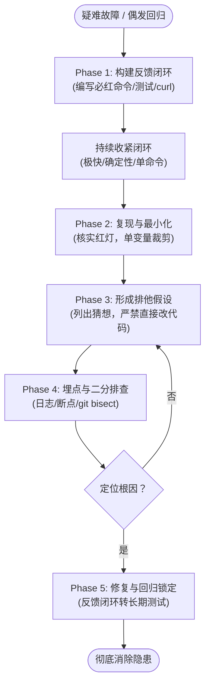

# 14. diagnosing-bugs（Diagnosing Bugs（疑难 Bug 诊断循环））

```yaml
name: diagnosing-bugs
description: 针对疑难杂症与性能回归的系统化诊断循环。当用户说出 “diagnose/debug this”（诊断/调试此问题），或者反馈系统出现损坏、报错抛出异常、运行失败或卡顿变慢时触发。
```

针对疑难 Bug 的一套严密工程纪律。仅在有充分且明确理由时才允许跳过某个阶段。

探索代码库时，如果存在 `CONTEXT.md`，请阅读它以建立对相关模块的清晰心智模型，并检查所触及区域的架构决策记录（ADRs）。

## 敏感信息脱敏（Redact）

本 skill 要求你向用户展示执行的命令、输出结果以及捕获的产物。**首先必须对所有敏感密钥进行脱敏** —— 用 `<REDACTED>` 替代它们。基于环境变量构建循环，确保凭据留在运行环境中，而不是暴露在你展示的内容里。捕获的请求产物通常带有鉴权请求头（auth headers）：只引用那些真正携带诊断信号的代码行。

如果脱敏后的输出不足以诊断 Bug，请明确告知用户并寻求协助。

---

## Phase 1 — 构建快速精准的反馈闭环（Build a feedback loop）

下图是疑难 Bug 诊断（Diagnosing Bugs）五阶段循环纪律的总览：



**这才是本 skill 的灵魂所在。** 除此之外的其他一切步骤都只是机械性的执行。如果你拥有一个针对该 Bug 的 **快速且精准（tight）** 的红绿判定信号 —— 即能在**这一个特定的 Bug** 上必然变红报错的信号 —— 你就必定能够找出根本原因；二分排查（bisection）、假设检验（hypothesis-testing）以及埋点分析（instrumentation）都仅仅是在消费这个信号。如果你没有这样一个反馈闭环，就算你把代码盯穿，也救不了你。

在此处投入不成比例的巨大精力。**积极主动，发挥创造力，绝不轻言放弃。**

### 构建反馈闭环的常见方式 —— 大致按此顺序尝试：

1. **失败的自动化测试（Failing test）**：在任何能够触达 Bug 的接缝处编写（单元测试、集成测试、端到端测试）。
2. **Curl / HTTP 脚本**：针对正在运行的本地开发服务器发起请求。
3. **CLI 命令行调用**：传入固定的测试夹具输入（fixture input），将 stdout 标准输出与已知正常的基准快照进行比对。
4. **无头浏览器脚本（Playwright / Puppeteer）**：驱动 UI 界面，断言 DOM 节点、控制台日志或网络请求。
5. **重放捕获的真实网络轨迹（Replay captured trace）**：将真实的线上网络请求、数据载荷或事件日志保存到本地磁盘；在隔离的代码路径中对其进行独立重放。
6. **一次性轻量测试脚手架（Throwaway harness）**：拉起系统的最小子集（单个服务、Mock 外部依赖），通过单次函数调用直接触发 Bug 所在的代码路径。
7. **属性测试 / 模糊测试循环（Property / fuzz loop）**：如果 Bug 的表现是“有时输出错误”，运行 1000 次随机输入，捕获其失效模式。
8. **二分查找测试桩（Bisection harness）**：如果 Bug 是在两个已知状态（特定 commit、数据集、版本号）之间引入的，自动化执行“在状态 X 下启动系统、检查是否报错、重复推进”，以便使用 `git bisect run` 自动定位。
9. **差分比对循环（Differential loop）**：将相同的输入分别送入旧版本与新版本（或两种不同配置），比对两者的输出差异。
10. **人机在环（HITL）交互式脚本**：最后的兜底手段。如果必须由人类进行手动点击，使用 `scripts/hitl-loop.template.sh` 脚本来引导人类操作，以确保整个反馈循环依然保持结构化。捕获的输出将重新回传给 Agent。

只要构建出了正确的反馈闭环，Bug 就已经修好了 90%。

### 进一步收紧反馈闭环（Tighten the loop）

将反馈闭环当成一件产品来精雕细琢。一旦你有了一个可运行的闭环，**进一步收紧它**：
- 我能让它运行得更快吗？（缓存初始化步骤、跳过无关启动项、收窄测试范围。）
- 我能让报错信号更加敏锐精准吗？（明确断言具体的报错症状，而不是模糊的“只要没崩溃就行”。）
- 我能让它更加确定和稳定吗？（固定当前时间戳、指定随机数种子、隔离文件系统、冻结网络请求。）

一个需要运行 30 秒且偶发不稳定的闭环，几乎和没有闭环一样糟糕；而一个 2 秒内必然稳定复现的确定性闭环，才是调试的超级武器。

### 针对非确定性（Flaky）偶发 Bug

此时的目标不是单次干净的复现，而是**大幅提高复现概率**。将触发逻辑循环运行 100 次、并发并行执行、增加负载压力、收窄时序窗口、注入微小的 sleep 延迟。一个拥有 50% 触发概率的 Flake 是完全可以调试的；但 1% 的概率则不可行 —— 请持续优化直到将其复现率提升到能够从容调试的水平。

### 当确实无法构建出任何闭环时

停下来并向用户明确说明。详细列出你已经尝试过的所有手段。向用户请求：(a) 能够复现该问题的具体环境访问权限，(b) 脱敏后的排查产物（HAR 文件、日志转储、Core Dump 崩溃转储、带有时间戳的录屏），或 (c) 在生产环境添加临时埋点探针的许可。**在建立起反馈闭环之前，严禁凭空跳入假设阶段。**

### 阶段 1 完成判据 —— 一个快速、精准且必定报红的闭环

阶段 1 宣告完成的标志是：反馈闭环已经**足够紧凑**且**具备精准报红能力**。你能够明确指出**一条具体的命令**（一个脚本路径、一次测试调用、一条 curl 命令），且你**已经至少成功运行过它一次**（展示命令及其脱敏后的输出），并满足：
- [ ] **具备报红能力（Red-capable）**：它能驱动发生 Bug 的真实代码路径，并精准断言**用户所描述的准确症状**，从而在当前 Bug 上变红报错，在 Bug 修复后变绿通过。而不是泛泛的“运行没有报错” —— 它必须能**准确抓住这一个特定的 Bug**。
- [ ] **确定性（Deterministic）**：每次运行都得出完全相同的结论（针对偶发 Bug：具备上述固定且高复现率）。
- [ ] **极快（Fast）**：执行时间以秒计，而不是以分钟计。
- [ ] **可由 Agent 独立无人值守运行（Agent-runnable）**：你可以自主运行它；只有在必要时才通过 `scripts/hitl-loop.template.sh` 引入人类在环。

如果你发现自己在尚未具备这条命令之前就已经在通读代码并构建理论猜想，**立刻停下 —— 凭空臆测假设正是本 skill 旨在彻底防止的经典失败模式。** 没有能够报红的验证命令，绝对禁止进入阶段 2。

---

## Phase 2 — 复现与最小化（Reproduce + minimise）

运行反馈闭环。亲眼看着它变红报错 —— 确认 Bug 稳定复现。

逐项核对确认：
- [ ] 闭环所产生的失效模式与**用户**描述的一致 —— 而不是恰好在附近发生的另一种无关报错。抓错 Bug 必然导致改错代码。
- [ ] 该报错在多次运行中均能稳定复现（或者对于偶发 Bug，复现率足够高以支撑后续调试）。
- [ ] 你已经捕获到了最精准的症状信息（错误信息、错误的输出内容、异常耗时），以便后续阶段能够验证修复方案确实解决了该症状。

### 极致最小化（Minimise）

一旦验证变红，将复现场景收缩到**能够保持报错的最简场景**。**每次只裁剪一项**输入数据、调用方、配置项、数据记录或操作步骤，并在每次裁剪后重新运行闭环 —— 仅保留那些对引发 Bug 必不可少的支撑性元素（load-bearing elements）。

为什么要费心做最小化：极简的复现场景能够大幅缩小阶段 3 中的假设空间（减少了需要怀疑的变量），并能直接演进为阶段 5 中干净利落的回归测试。

当且仅当**所有残留的元素都是不可或缺的**时（即删除其中任意一项都会导致闭环变绿不再报错），最小化阶段方告完成。

在完成复现**并且**最小化之前，绝不推进到下一阶段。

---

## Phase 3 — 提出假设（Hypothesise）

在对任何假设进行实际测试之前，先生成 **3 到 5 个按可能性排序的假设**。如果一次只生成单个假设，极易让人思维僵化并锚定在第一个看似合理的念头上。

每一个假设都必须是**可证伪的（falsifiable）**：明确说明该假设所做出的具体预测。

> 格式标准：“如果 `<X 是根本原因>`，那么 `<修改 Y>` 会让该 Bug 彻底消失 / 或者 `<修改 Z>` 会让该 Bug 变得更加严重。”

如果你无法清晰说出这种因果预测，说明这个假设只是凭感觉的盲目猜测 —— 必须丢弃它或将其细化打磨。

**在动手测试前，先将排序后的假设列表展示给用户**。用户通常拥有专属的领域知识，能够瞬间重新对假设进行排序（例如“我们刚才正好上线了针对第 3 点的改动”），或者直接指出他们之前已经排除过的假设。这是一个成本极低但收益巨大的检查点。但不要因此阻塞流程 —— 如果用户当前不在线，你可以按照自己的排序继续推进。

---

## Phase 4 — 精准埋点探测（Instrument）

每一个探测点都必须严格映射到阶段 3 中的某一项具体因果预测。**一次只修改一个变量。**

工具与手段偏好：
1. **调试器（Debugger） / REPL 交互探查**（如果运行环境支持）。一个断点胜过十条打印日志。
2. 在能够区分不同假设的关键边界处添加**针对性日志（Targeted logs）**。
3. 严禁盲目地“打印一切然后靠 grep 搜索”。

**为每一条调试日志打上唯一的特定前缀**，例如 `[DEBUG-a4f2]`。这样在最后清理现场时只需一次全局 grep 就能彻底删光。没有前缀的日志容易被遗漏残留；打了前缀的日志可以一网打尽。

**性能回归排查分支**：对于性能下降问题，打印日志通常是帮倒忙的（日志本身会严重改变耗时特征）。应该改为：建立基准测量工具（耗时分析桩、`performance.now()`、Profiler 性能分析器、数据库查询执行计划），然后进行二分排查。**先精准度量，后动手修复。**

---

## Phase 5 — 修复与回归测试（Fix + regression test）

**在编写修复代码之前，先编写回归测试** —— 但前提是代码库中存在**正确的测试接缝（correct seam）**。

所谓“正确的接缝”，是指测试能够完整演练该 Bug 在实际调用点处发生的**真实错误模式**。如果当前唯一的可用接缝过浅（例如 Bug 实际涉及多个调用方、却只有单调用方的测试可用；或者单元测试根本无法还原触发 Bug 的完整调用链条），在此处编写回归测试只会带来虚假的安全感。

**如果不存在正确的接缝，这本身就是一项重大的架构发现**。记录下来：说明代码库当前的架构阻碍了彻底锁死该 Bug。将这一发现标记留给下一阶段。

如果存在正确的接缝：
1. 将最小化后的复现案例转化为该接缝处的一个失败测试。
2. 亲眼看着它运行失败（红）。
3. 应用你的修复代码。
4. 亲眼看着它运行通过（绿）。
5. 重新运行阶段 1 的初始反馈闭环，验证原始（未做最小化裁剪前）的完整业务场景已被成功修复。

---

## Phase 6 — 清理现场与复盘反思（Cleanup + post-mortem）

在正式宣布排查完成之前，必须逐项核对：
- [ ] 原始复现场景不再发生报错（重新运行阶段 1 的闭环）
- [ ] 回归测试绿灯通过（或者接缝缺失的现状已被清晰记录为文档）
- [ ] 所有带 `[DEBUG-...]` 标记的临时调试埋点已彻底清除（通过 `grep` 验证）
- [ ] 一次性测试原型已删除（或已移动到明确标记的调试归档位置）
- [ ] 最终被证实正确的根本原因假设已清晰写在 commit 提交信息或 PR 描述中 —— 让下一位调试者能够学习沉淀

**最后必须反思：怎样做才能在最初就彻底预防此类 Bug 的发生？** 如果答案涉及架构层面的改进（例如缺乏良好的测试接缝、调用关系错综复杂、存在隐蔽的耦合），请将具体细节交接给 `/improve-codebase-architecture` skill。**请务必在修复代码完全落地之后再提出此类架构建议**，而不要在刚开始时提 —— 因为此时你掌握的信息远比刚开始排查时要丰富和透彻得多。

## Companion 摘要：`scripts/hitl-loop.template.sh`

- **角色**：Phase 1 第 10 招——人必须参与点击/观察时，仍保持 **结构化、可解析** 的反馈循环。
- **机制**：`step "指令"` 打印说明并等 Enter；`capture VAR "问题"` 读入用户回答到变量。
- **输出**：末尾 `KEY=VALUE` 块供 agent 解析（如 `ERRORED=y`、`ERROR_MSG=...`）。
- **安全提示**：`capture` 会把值打回 terminal（agent 可读）——适合观察结果；登录等敏感操作应放在 `step`，勿 capture 凭据。
- **用法**：复制模板 → 改 edit 区步骤 → `bash hitl-loop.template.sh`；agent 跑脚本，用户在终端跟提示。

---

## 📑 附录：技能元信息与英文原文

### 📌 元数据（Meta）

| 字段 | 值 |
|---|---|
| bucket | `engineering/` |
| path | `skills/engineering/diagnosing-bugs/` |
| url | https://github.com/mattpocock/skills/tree/main/skills/engineering/diagnosing-bugs |
| name | `diagnosing-bugs` |
| 触发 | description：硬 bug 与性能回归的 diagnosis loop；用户说 diagnose/debug this，或报告 broken/throwing/failing/slow |
| 调用策略 | 默认可触发 |
| companions | `scripts/hitl-loop.template.sh`——HITL 再现循环模板；本页只摘要，不全文翻译 |
| 相关 skill | 无正确 seam 时 post-mortem 可 handoff `/improve-codebase-architecture`；regression 测试哲学对齐 `/tdd` |

<br>

<details>
<summary><b>📄 点击展开查看英文原文 (原版可直接复制)</b></summary>

```markdown
---
name: diagnosing-bugs
description: Diagnosis loop for hard bugs and performance regressions. Use when the user says "diagnose"/"debug this", or reports something broken/throwing/failing/slow.
---

# Diagnosing Bugs

A discipline for hard bugs. Skip phases only when explicitly justified.

When exploring the codebase, read `CONTEXT.md` (if it exists) to get a clear mental model of the relevant modules, and check ADRs in the area you're touching.

## Redact

This skill has you show commands, outputs and captured artifacts. **Redact every secret first** — write `<REDACTED>` in its place. Build loops against env vars, so the credential stays in the environment rather than in what you show. Captured artifacts carry auth headers: quote only the lines that carry the signal.

If the redacted output is not enough to diagnose the bug, say so and ask the user.

## Phase 1 — Build a feedback loop

**This is the skill.** Everything else is mechanical. If you have a **tight** pass/fail signal for the bug — one that goes red on _this_ bug — you will find the cause; bisection, hypothesis-testing, and instrumentation all just consume it. If you don't have one, no amount of staring at code will save you.

Spend disproportionate effort here. **Be aggressive. Be creative. Refuse to give up.**

### Ways to construct one — try them in roughly this order

1. **Failing test** at whatever seam reaches the bug — unit, integration, e2e.
2. **Curl / HTTP script** against a running dev server.
3. **CLI invocation** with a fixture input, diffing stdout against a known-good snapshot.
4. **Headless browser script** (Playwright / Puppeteer) — drives the UI, asserts on DOM/console/network.
5. **Replay a captured trace.** Save a real network request / payload / event log to disk; replay it through the code path in isolation.
6. **Throwaway harness.** Spin up a minimal subset of the system (one service, mocked deps) that exercises the bug code path with a single function call.
7. **Property / fuzz loop.** If the bug is "sometimes wrong output", run 1000 random inputs and look for the failure mode.
8. **Bisection harness.** If the bug appeared between two known states (commit, dataset, version), automate "boot at state X, check, repeat" so you can `git bisect run` it.
9. **Differential loop.** Run the same input through old-version vs new-version (or two configs) and diff outputs.
10. **HITL bash script.** Last resort. If a human must click, drive _them_ with `scripts/hitl-loop.template.sh` so the loop is still structured. Captured output feeds back to you.

Build the right feedback loop, and the bug is 90% fixed.

### Tighten the loop

Treat the loop as a product. Once you have _a_ loop, **tighten** it:

- Can I make it faster? (Cache setup, skip unrelated init, narrow the test scope.)
- Can I make the signal sharper? (Assert on the specific symptom, not "didn't crash".)
- Can I make it more deterministic? (Pin time, seed RNG, isolate filesystem, freeze network.)

A 30-second flaky loop is barely better than no loop; a 2-second deterministic one is tight — a debugging superpower.

### Non-deterministic bugs

The goal is not a clean repro but a **higher reproduction rate**. Loop the trigger 100×, parallelise, add stress, narrow timing windows, inject sleeps. A 50%-flake bug is debuggable; 1% is not — keep raising the rate until it's debuggable.

### When you genuinely cannot build a loop

Stop and say so explicitly. List what you tried. Ask the user for: (a) access to whatever environment reproduces it, (b) a redacted captured artifact (HAR file, log dump, core dump, screen recording with timestamps), or (c) permission to add temporary production instrumentation. Do **not** proceed to hypothesise without a loop.

### Completion criterion — a tight loop that goes red

Phase 1 is done when the loop is **tight** and **red-capable**: you can name **one command** — a script path, a test invocation, a curl — that you have **already run at least once** (show the invocation and its output, redacted), and that is:

- [ ] **Red-capable** — it drives the actual bug code path and asserts the **user's exact symptom**, so it can go red on this bug and green once fixed. Not "runs without erroring" — it must be able to _catch this specific bug_.
- [ ] **Deterministic** — same verdict every run (flaky bugs: a pinned, high reproduction rate, per above).
- [ ] **Fast** — seconds, not minutes.
- [ ] **Agent-runnable** — you can run it unattended; a human in the loop only via `scripts/hitl-loop.template.sh`.

If you catch yourself reading code to build a theory before this command exists, **stop — jumping straight to a hypothesis is the exact failure this skill prevents.** No red-capable command, no Phase 2.

## Phase 2 — Reproduce + minimise

Run the loop. Watch it go red — the bug appears.

Confirm:

- [ ] The loop produces the failure mode the **user** described — not a different failure that happens to be nearby. Wrong bug = wrong fix.
- [ ] The failure is reproducible across multiple runs (or, for non-deterministic bugs, reproducible at a high enough rate to debug against).
- [ ] You have captured the exact symptom (error message, wrong output, slow timing) so later phases can verify the fix actually addresses it.

### Minimise

Once it's red, shrink the repro to the **smallest scenario that still goes red**. Cut inputs, callers, config, data, and steps **one at a time**, re-running the loop after each cut — keep only what's load-bearing for the failure.

Why bother: a minimal repro shrinks the hypothesis space in Phase 3 (fewer moving parts left to suspect) and becomes the clean regression test in Phase 5.

Done when **every remaining element is load-bearing** — removing any one of them makes the loop go green.

Do not proceed until you have reproduced **and** minimised.

## Phase 3 — Hypothesise

Generate **3–5 ranked hypotheses** before testing any of them. Single-hypothesis generation anchors on the first plausible idea.

Each hypothesis must be **falsifiable**: state the prediction it makes.

> Format: "If <X> is the cause, then <changing Y> will make the bug disappear / <changing Z> will make it worse."

If you cannot state the prediction, the hypothesis is a vibe — discard or sharpen it.

**Show the ranked list to the user before testing.** They often have domain knowledge that re-ranks instantly ("we just deployed a change to #3"), or know hypotheses they've already ruled out. Cheap checkpoint, big time saver. Don't block on it — proceed with your ranking if the user is AFK.

## Phase 4 — Instrument

Each probe must map to a specific prediction from Phase 3. **Change one variable at a time.**

Tool preference:

1. **Debugger / REPL inspection** if the env supports it. One breakpoint beats ten logs.
2. **Targeted logs** at the boundaries that distinguish hypotheses.
3. Never "log everything and grep".

**Tag every debug log** with a unique prefix, e.g. `[DEBUG-a4f2]`. Cleanup at the end becomes a single grep. Untagged logs survive; tagged logs die.

**Perf branch.** For performance regressions, logs are usually wrong. Instead: establish a baseline measurement (timing harness, `performance.now()`, profiler, query plan), then bisect. Measure first, fix second.

## Phase 5 — Fix + regression test

Write the regression test **before the fix** — but only if there is a **correct seam** for it.

A correct seam is one where the test exercises the **real bug pattern** as it occurs at the call site. If the only available seam is too shallow (single-caller test when the bug needs multiple callers, unit test that can't replicate the chain that triggered the bug), a regression test there gives false confidence.

**If no correct seam exists, that itself is the finding.** Note it. The codebase architecture is preventing the bug from being locked down. Flag this for the next phase.

If a correct seam exists:

1. Turn the minimised repro into a failing test at that seam.
2. Watch it fail.
3. Apply the fix.
4. Watch it pass.
5. Re-run the Phase 1 feedback loop against the original (un-minimised) scenario.

## Phase 6 — Cleanup + post-mortem

Required before declaring done:

- [ ] Original repro no longer reproduces (re-run the Phase 1 loop)
- [ ] Regression test passes (or absence of seam is documented)
- [ ] All `[DEBUG-...]` instrumentation removed (`grep` the prefix)
- [ ] Throwaway prototypes deleted (or moved to a clearly-marked debug location)
- [ ] The hypothesis that turned out correct is stated in the commit / PR message — so the next debugger learns

**Then ask: what would have prevented this bug?** If the answer involves architectural change (no good test seam, tangled callers, hidden coupling) hand off to the `/improve-codebase-architecture` skill with the specifics. Make the recommendation **after** the fix is in, not before — you have more information now than when you started.
```

</details>
