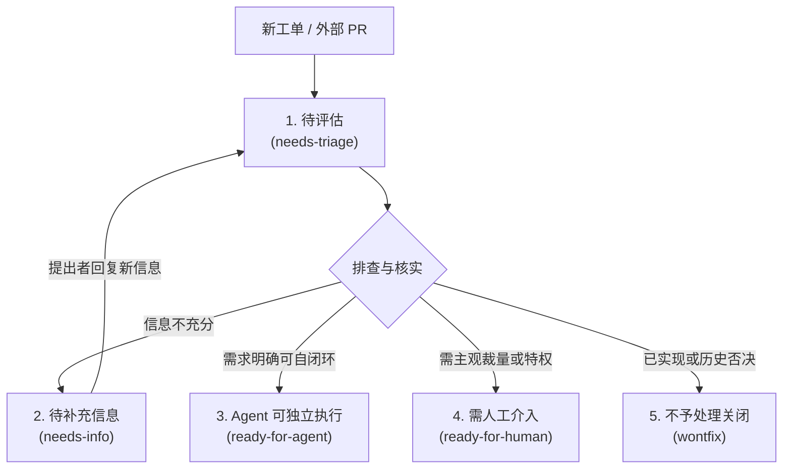

# 18. triage（Triage（工单与外部 PR 分流归类））

```yaml
name: triage
description: 通过一套严谨的分流角色状态机流转管理工单（issues）与外部 PR —— 进行分类归档、环境复现验证、按需追问澄清，并编写适合 Agent 独立执行的任务简报（agent-ready briefs）。
disable-model-invocation: true
```

通过项目工单跟踪系统上的轻量分流角色状态机，流转各项工单。

如果当前仓库将外部 PR（Pull Requests）同样视为待处理的需求提交入口（详见 issue-tracker 配置），Triage 也一并涵盖它们：**PR 本质上就是一个附带了代码的 Issue** —— 拥有相同的角色、相同的状态与相同的状态机流转逻辑，仅在下方标注了少数“针对 PR”的特有差异。根据工单系统配置，将裸编号 `#42` 解析为 Issue 或 PR。

在 Triage 分流期间，向工单系统发布的每一条评论或工单正文，**必须**以这句声明开头：

```markdown
> *This was generated by AI during triage.（本内容由 AI 在分流梳理过程中生成）*
```

## 参考文档

- [AGENT-BRIEF.md](./18-triage_AGENT-BRIEF.md) — 如何编写持久、防歧义的 Agent 任务简报
- [OUT-OF-SCOPE.md](./18-triage_OUT-OF-SCOPE.md) — `.out-of-scope/` 知识库的工作机制

---

## 角色与状态定义（Roles）

下图是五种工单分流流转状态（States）与流转条件的总览：



两个 **分类维度（Category）**：
- `bug` — 系统某些功能出现损坏或异常
- `enhancement` — 新功能特性或优化改进建议

五个 **流转状态维度（State）**：
- `needs-triage` — 待维护者进一步评估
- `needs-info` — 正在等待工单提出者补充更多必要信息
- `ready-for-agent` — 需求已完全明确，随时可交由无人值守的 Agent 独立执行
- `ready-for-human` — 必须由人类开发者介入实现的复杂事项
- `wontfix` — 经审议决定不予处理或关闭的事项

对于 PR，上述状态对照其附带的代码来理解：`ready-for-agent` 意味着已附带任务简报，Agent 应当接手对该 diff 进行下一步处理；`ready-for-human` 意味着它已就绪，等待人类维护者进行合并。

每一个经过 Triage 梳理的工单，**都应当恰好被打上一个分类标签和一个状态标签**。如果状态标签出现冲突，立刻标记出来并在执行任何操作前先向维护者确认。

以上为标准规范的角色名称 —— 工单系统上实际配置的标签文本字符串可能略有不同。映射关系应该已经配置完毕；如果尚未配置，请提示用户运行 `/setup-matt-pocock-skills`。

**状态流转规则**：一个未打标的新工单通常先进入 `needs-triage`；随后流转至 `needs-info`、`ready-for-agent`、`ready-for-human` 或 `wontfix`。当提出者在 `needs-info` 状态下回复了补充信息后，工单自动退回 `needs-triage`。维护者可以随时手动覆盖流转 —— 对看起来异常的流转主动标出并先向维护者请示。

---

## 调用方式（Invocation）

维护者调用 `/triage` 并使用自然语言描述其诉求。理解意图并执行对应操作。示例：
- “请向我展示当前需要我关注的所有事项”
- “让我们看下 #42 号事项”（Issue 或 PR）
- “将 #42 推进到 ready-for-agent 状态”
- “目前有哪些事项已经就绪可供 Agent 领取执行？”

---

## 展示需要关注的事项（Show what needs attention）

查询工单系统并按创建时间由旧到新呈现三个集合桶：
1. **未打标（Unlabeled）** — 从未进行过分流梳理的新事项。
2. **`needs-triage`** — 正在评估推进中的事项。
3. **`needs-info` 且提出者已有新回复** — 自上次分流记录以来有了新动向，需要重新评估。

当 PR 在扫描范围内时，将外部 PR 纳入上述桶中，并在每行开头标记 `[PR]` 或 `[issue]`。自动发现仅扫描**外部**贡献者的 PR（工单配置定义了哪些人算外部） —— 协作者自身进行中的 PR 不属于分流工作。此过滤仅用于列表发现；如果维护者明确指定了某个 PR 编号，无论作者是谁都照常分流。

展示统计数量并为每一项提供单行摘要，供维护者点选处理。

---

## 对特定 Issue 或 PR 执行深度分流

1. **收集上下文（Gather context）**：通读完整的 Issue 或 PR（正文、所有评论、标签、作者、时间；对于 PR 还要阅读 diff）。解析既往的所有分流记录，确保不会重复提出已经解决的问题。使用项目的领域词汇表探索代码库，遵循该区域的 ADR 记录。对代码库进行两项核心排查：  
   (a) **重复性排查（Redundancy）** — 按照领域概念（而不只是工单的字面用词）搜索代码库中是否早已实现了所请求的行为，并汇报你排查了哪些位置。如果已经实现，归入“已实现 wontfix”（步骤 5）；  
   (b) **历史否决排查（Prior rejection）** — 阅读 `.out-of-scope/*.md`，呈报其中与本请求相似的历史否决记录。

2. **给出评估建议（Recommend）**：向维护者汇报你建议的分类与状态，并附带充分理由，同时提供与该请求高度相关的代码库简要概述（包括是否已被实现）。等待维护者给出方向指示。

3. **核实事实（Verify the claim）**：在展开深度访谈前，首先核实该诉求是否真实成立。对于 Bug，按照提出者的步骤尝试复现；对于 PR，检出分支并运行关联测试或命令，验证 diff 是否确实实现了其声称的功能。汇报验证结果：已证实（附带代码路径）、复现失败、或细节不足（强烈的 `needs-info` 信号）。经过确凿验证的事项能够产出质量极高的 Agent 任务简报。

4. **按需追问（Grill if needed）**：如果该需求需要进一步充实具象化，通过 Skill 工具先后两次调用："grilling" 与 "domain-modeling" —— 按轮次提问逐步将其打磨成型，澄清领域术语，并在决策敲定后实时更新 `CONTEXT.md` 和 ADR。

5. **落地最终流转结果（Apply the outcome）**：
   - `ready-for-agent` — 发表一条 Agent 任务简报评论（遵循 [AGENT-BRIEF.md](./18-triage_AGENT-BRIEF.md) 格式）。
   - `ready-for-human` — 结构与 Agent 任务简报相同，但清晰注明为何不能委派给 AI（主观价值裁量、需要外部访问权限、核心设计决策、必须由人工完成的实机测试等）。
   - `needs-info` — 发表分流记录评论（使用下方模板）。
   - `wontfix` — 关闭事项，根据原因发表对应评论：
     - **已经实现（Already implemented）** — 代码库中已存在该功能。明确指出其所在位置；**切勿**写入 `.out-of-scope/`（该知识库仅用于记录*被否决*的需求，而非已实现的功能）。
     - **Bug 被否决（Rejected bug）** — 给出礼貌且详尽的技术解释，然后关闭。
     - **功能建议被否决（Rejected enhancement）** — 将否决背景写入 `.out-of-scope/`，在评论中链接该文件，然后关闭（遵循 [OUT-OF-SCOPE.md](./18-triage_OUT-OF-SCOPE.md)）。
   - `needs-triage` — 打上该状态标签。如果有阶段性进展可发表简要评论。

---

## 快速状态覆盖（Quick state override）

如果维护者明确指示“将 #42 直接移到 ready-for-agent”，充分信任维护者并直接应用该状态标签。向维护者确认即将执行的动作（标签变更、发表评论、关闭事项），随后执行，跳过深度访谈。若是未经访谈就直接移至 `ready-for-agent`，主动询问维护者是否需要为其撰写一份 Agent 任务简报。

---

## 待补充信息模板（Needs-info template）

```markdown
## Triage Notes（分流处理记录）

**What we've established so far（目前已明确的事项）:**
- 明确要点 1
- 明确要点 2

**What we still need from you (@reporter)（仍需提出者提供的信息）:**
- 针对性具体问题 1
- 针对性具体问题 2
```

将追问过程中已经敲定的所有结论全部汇总在“目前已明确的事项”之下，确保前期的沟通努力不会白费。提出的问题必须极其具体且具备可操作性，严禁写成宽泛模糊的“请提供更多信息”。

## 接续先前的分流会话（Resuming a previous session）

如果 Issue 或 PR 上已经存在先前的分流记录，首先阅读它们，检查提出者是否已经回答了未决问题，并在继续之前呈现最新的进展全貌。切勿重复追问已经解决的历史问题。

---

## 📑 附录：技能元信息与英文原文

### 📌 元数据（Meta）

| 字段 | 值 |
|---|---|
| bucket | `engineering/` |
| path | `skills/engineering/triage/` |
| url | https://github.com/mattpocock/skills/tree/main/skills/engineering/triage |
| name | `triage` |
| 触发方式 | description：Move issues and external PRs through a state machine of triage roles（user-invoked） |
| companions | [AGENT-BRIEF.md](./18-triage_AGENT-BRIEF.md)、[OUT-OF-SCOPE.md](./18-triage_OUT-OF-SCOPE.md)——本页只列角色，不全文翻译 |
| 产物 | 分类（bug/enhancement） + 状态（needs-triage/needs-info/ready-for-agent/ready-for-human/wontfix） |
| 消费方 | `implement`（产出 ready-for-agent tickets） |

<br>

<details>
<summary><b>📄 点击展开查看英文原文 (原版可直接复制)</b></summary>

````markdown
---
name: triage
description: Move issues and external PRs through a state machine of triage roles, categorise, verify, grill if needed, and write agent-ready briefs.
disable-model-invocation: true
---

# Triage

Move issues on the project issue tracker through a small state machine of triage roles.

If this repo treats external pull requests as a request surface (see the issue-tracker config), triage covers them too: **a PR is an issue with attached code**, using the same roles, same states, and same machine, with a few deltas marked "for a PR" below. Resolve a bare `#42` to an issue or PR per the tracker config.

Every comment or issue posted to the issue tracker during triage **must** start with this disclaimer:

```
> *This was generated by AI during triage.*
```

## Reference docs

- [AGENT-BRIEF.md](./18-triage_AGENT-BRIEF.md): how to write durable agent briefs
- [OUT-OF-SCOPE.md](./18-triage_OUT-OF-SCOPE.md): how the `.out-of-scope/` knowledge base works

## Roles

Two **category** roles:

- `bug`: something is broken
- `enhancement`: new feature or improvement

Five **state** roles:

- `needs-triage`: maintainer needs to evaluate
- `needs-info`: waiting on reporter for more information
- `ready-for-agent`: fully specified, ready for an AFK agent
- `ready-for-human`: needs human implementation
- `wontfix`: will not be actioned

For a PR, the same states read against the attached code: `ready-for-agent` means a brief is attached and an agent should take the next step on the diff; `ready-for-human` means it's ready for a human to merge.

Every triaged issue should carry exactly one category role and one state role. If state roles conflict, flag it and ask the maintainer before doing anything else.

These are canonical role names. The actual label strings used in the issue tracker may differ. The mapping should have been provided to you. If not, tell the user to run `/setup-matt-pocock-skills`.

State transitions: an unlabeled issue normally goes to `needs-triage` first; from there it moves to `needs-info`, `ready-for-agent`, `ready-for-human`, or `wontfix`. `needs-info` returns to `needs-triage` once the reporter replies. The maintainer can override at any time; flag transitions that look unusual and ask before proceeding.

## Invocation

The maintainer invokes `/triage` and describes what they want in natural language. Interpret the request and act. Examples:

- "Show me anything that needs my attention"
- "Let's look at #42" (issue or PR)
- "Move #42 to ready-for-agent"
- "What's ready for agents to pick up?"

## Show what needs attention

Query the issue tracker and present three buckets, oldest first:

1. **Unlabeled**: never triaged.
2. **`needs-triage`**: evaluation in progress.
3. **`needs-info` with reporter activity since the last triage notes**: needs re-evaluation.

When PRs are in scope, include external PRs in these buckets and tag each line `[PR]` or `[issue]`. Discovery surfaces only *external* PRs (the tracker config defines who counts as external), so a collaborator's in-flight PR is not triage work. This filter is discovery-only; an explicitly named PR is always triaged regardless of author.

Show counts and a one-line summary per item. Let the maintainer pick.

## Triage a specific issue or PR

1. **Gather context.** Read the full issue or PR (body, comments, labels, author, dates; for a PR, the diff too). Parse any prior triage notes so you don't re-ask resolved questions. Explore the codebase using the project's domain glossary, respecting ADRs in the area. Run two checks against the codebase: (a) **redundancy**: search for an existing implementation of the requested behavior by domain concept (not just the request's wording), and report where you looked. If found, it's an already-implemented `wontfix` (step 5). (b) **prior rejection**: read `.out-of-scope/*.md` and surface any that resembles this request.

2. **Recommend.** Tell the maintainer your category and state recommendation with reasoning, plus a brief codebase summary relevant to the request (including whether it's already implemented). Wait for direction.

3. **Verify the claim.** Before any grilling, check that the claim holds up. For a bug, reproduce it from the reporter's steps. For a PR, confirm the diff does what it claims: check it out, run the relevant tests or commands. Report what happened: confirmed (with code path), failed, or insufficient detail (a strong `needs-info` signal). A confirmed verification makes a much stronger agent brief.

4. **Grill (if needed).** If the request needs fleshing out, call the Skill tool twice, for "grilling" and "domain-modeling", and grill it into shape a round of questions at a time, sharpening domain terms and updating `CONTEXT.md`/ADRs inline as decisions land.

5. **Apply the outcome:**
   - `ready-for-agent`: post an agent brief comment ([AGENT-BRIEF.md](./18-triage_AGENT-BRIEF.md)).
   - `ready-for-human`: same structure as an agent brief, but note why it can't be delegated (judgment calls, external access, design decisions, manual testing).
   - `needs-info`: post triage notes (template below).
   - For `wontfix`, close the issue, with the comment depending on *why*:
     - **Already implemented**: the change already exists in the codebase. Point to where it lives; do **not** write to `.out-of-scope/` (that KB is for *rejected* requests, not built ones).
     - **Rejected (bug)**: give a polite explanation, then close.
     - **Rejected (enhancement)**: write to `.out-of-scope/`, link to it from a comment, then close ([OUT-OF-SCOPE.md](./18-triage_OUT-OF-SCOPE.md)).
   - `needs-triage`: apply the role. Optional comment if there's partial progress.

## Quick state override

If the maintainer says "move #42 to ready-for-agent", trust them and apply the role directly. Confirm what you're about to do (role changes, comment, close), then act. Skip grilling. If moving to `ready-for-agent` without a grilling session, ask whether they want to write an agent brief.

## Needs-info template

```markdown
## Triage Notes

**What we've established so far:**

- point 1
- point 2

**What we still need from you (@reporter):**

- question 1
- question 2
```

Capture everything resolved during grilling under "established so far" so the work isn't lost. Questions must be specific and actionable, not "please provide more info".

## Resuming a previous session

If prior triage notes exist on the issue or PR, read them, check whether the reporter has answered any outstanding questions, and present an updated picture before continuing. Don't re-ask resolved questions.
````

</details>
