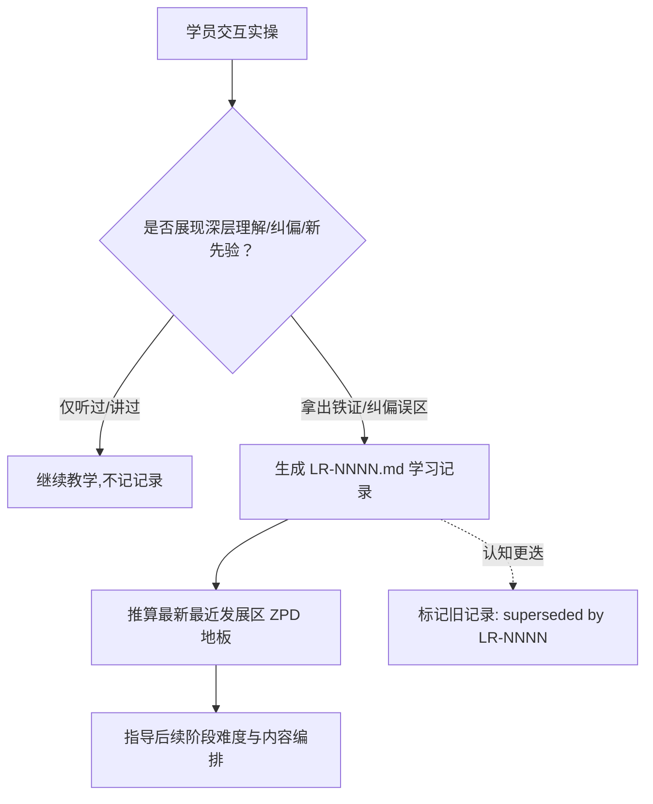

# 23-teach / LEARNING-RECORD-FORMAT.md 精读（学习记录档案格式与认知基线规范（Learning Record Format））

所有的学习记录（Learning records）均保存在 `./learning-records/` 目录下，并使用四位自增数字编号：`0001-slug.md`、`0002-slug.md` 等。采用**懒加载**方式创建该目录 —— 仅在写下第一篇学习记录时才创建它。

**学习记录是教学领域的 ADR（架构决策记录）**：它们捕获了非显然的学习体会、关键认知跃迁以及学员自述的既有知识先验，以此精准调控未来的教学会话。**它们是精确推算学员当前“最近发展区（ZPD）”的唯一数学基准**。

---

## 1. 标准极简模板（Template）

```markdown
# {所掌握认知或所确立先验的简短标题}

{用 1 到 3 句话说明：学员究竟真正掌握了什么（或者确认了具备哪些先验知识），以及为什么这会直接改变接下来会话的教学策略。}
```

**这就是全部的格式要求。一篇学习记录完全可以只有短短一个自然段**。其核心价值在于郑重记录“*这项知识如今已被牢牢掌握* 以及 *它为何能改变后续教什么*” —— 而绝不是去僵化地把各个大部头章节填满。

---

## 2. 可选扩展章节

绝大多数记录根本不需要这些章节，仅在带来实质价值时才按需选用：
- **状态属性（Status frontmatter）**：`active`（生效中） / `superseded by LR-NNNN`（已被某号记录所取代） —— 当早期的理解被推翻并完成升级时极其有用；
- **掌握凭证（Evidence）**：学员究竟是如何证明其真正理解的（如答对了一个深度追问、独立完成了一道实操演练、或提供了经得起推敲的历史实战经历）；
- **潜在启示（Implications）**：该认知的达成，为未来的教学解锁了哪些崭新大门，或彻底排除了哪些不必要的初级讲授。

---

## 3. 究竟何时才配写下一篇学习记录？

**唯有同时满足以下四大触发条件之一时，才允许落盘撰写：**

1. **学员对非平庸的深层知识展现出了真正的掌握** —— 绝不仅仅是“听过或看过”，而是拿出了能够正确自如运用该概念的铁证。**这为接下来的教学划定了全新的认知地板高度**；
2. **学员显式公开了其既有先验知识** —— “我早就精通 X 了”。记录下来，确保未来的所有教学会话绝不再做低效的重复赘述，并如实记录其自称的掌握深度；
3. **成功纠偏了长期存在的深层认知误区（Misconception corrected）** —— 学员此前一直抱有错误直觉，现在彻底看清了本质原理。**这类记录价值千金：它们能够精准预判学员在探索相关高级主题时可能遇到的绊脚石**；
4. **伴随认知升级，终极学习使命发生了跃迁** —— 学员在学习中忽然发现自己真正热爱并关心的方向与最初设想截然不同。立即交叉引用 `MISSION.md` 并同步更新使命。

---

## 4. 绝对不配入选的负向清单（What does NOT qualify）

- **仅仅在会话中“讲过或提及过”的材料**。讲过绝不等于学会，必须等待学员拿出掌握凭证；
- 任何已经简明扼要收录在 `GLOSSARY.md` 术语表中的名词定义，拒绝冗余复读；
- **逐日流水账式的流水日记**。学习记录是**决策级的认知洞见（Decision-grade insights）**，绝不是平庸的日记本。

---

## 5. 认知升级与历史迭代机制（Supersession）

当后期的深层理解与早期的浅层记录发生冲突矛盾时（学员的认知获得了本质深化与纠偏），**将旧记录标记为 `Status: superseded by LR-NNNN`，坚决不要粗暴删除它**。学员认知从幼稚走向成熟的完整演进轨迹，本身就是极具价值的教学信号。

---

## 6. 学习记录与教学闭环机制图



---

## 📑 附录：技能元信息与英文原文

### 📌 元数据（Meta）

| 字段 | 值 |
|---|---|
| 对应主 Skill | `23-teach` |
| bucket | productivity |
| 上游路径 | `skills/productivity/teach/LEARNING-RECORD-FORMAT.md` |
| 角色定位 | 学习记录档案格式与认知基线评估规范（Learning Record Specification） |
| 关联模块 | `23-teach`、`15-domain-modeling` |

<br>

<details>
<summary><b>📄 点击展开查看英文原文 (原版可直接复制)</b></summary>

````markdown
# Learning Record Format

Learning records live in `./learning-records/` and use sequential numbering: `0001-slug.md`, `0002-slug.md`, etc. Create the directory lazily — only when the first record is written.

They are the teaching equivalent of ADRs: they capture non-obvious lessons, key insights, and stated prior knowledge that will steer future sessions. They are used to calculate the zone of proximal development.

## Template

```md
# {Short title of what was learned or established}

{1-3 sentences: what was learned (or what prior knowledge was established), and why it matters for future sessions.}
```

That is the whole format. A learning record can be a single paragraph. The value is recording _that_ this is now known and _why_ it changes what to teach next — not in filling out sections.

## Optional sections

Only include these when they add genuine value. Most records won't need them.

- **Status** frontmatter (`active | superseded by LR-NNNN`) — useful when an earlier understanding turns out to be wrong and is replaced.
- **Evidence** — how the user demonstrated the understanding (a question answered, an exercise completed, prior experience cited). Useful when the claim might be revisited.
- **Implications** — what this unlocks or rules out for future sessions. Worth recording when non-obvious.

## Numbering

Scan `./learning-records/` for the highest existing number and increment by one.

## When to write a learning record

Write one when any of these is true:

1. **The user demonstrated genuine understanding of something non-trivial** — not just exposure, but evidence they can use the concept correctly. This sets a new floor for what to teach next.
2. **The user disclosed prior knowledge** — "I already know X." Record it so future sessions don't re-teach it. Also record the _depth_ claimed.
3. **A misconception was corrected** — the user previously believed something wrong and now sees why. These are high-value: they predict future stumbling blocks for related topics.
4. **The mission shifted in response to learning** — the user discovered they cared about something different than they thought. Cross-link to [MISSION.md](./23-teach_MISSION-FORMAT.md) and update it.

### What does _not_ qualify

- Material that was merely covered. Coverage is not learning. Wait for evidence.
- Anything already captured tersely in [GLOSSARY.md](./23-teach_GLOSSARY-FORMAT.md) as a term definition. Don't duplicate.
- Session-by-session activity logs. Learning records are not a journal — they are decision-grade insights.

## Supersession

When a later record contradicts an earlier one (the user's understanding deepened or corrected), mark the old record `Status: superseded by LR-NNNN` rather than deleting it. The history of how understanding evolved is itself useful signal.
````

</details>
