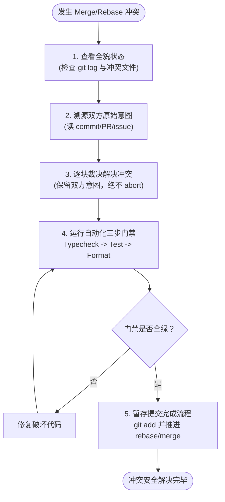

# 25. resolving-merge-conflicts（Resolving Merge Conflicts（Git 代码冲突解决纪律））

```yaml
name: resolving-merge-conflicts
description: 当你需要解决正在进行中的 Git 合并（merge）或变基（rebase）代码冲突时使用。
```

下图是代码冲突解决（Resolving Merge Conflicts）五步纪律的总览：



1. **看清当前的全貌状态（See the current state）**：全面检查当前 merge / rebase 的冲突状态。查阅 Git 提交历史（git log）以及所有处于冲突状态的文件清单。
2. **查明每一处冲突的一手资料（Find the primary sources）**：针对每一个冲突点，深入理解双方改动背后的根本原因以及最初的代码意图。仔细阅读提交信息（Commit messages）、查阅对应的 PR 说明、以及关联的原始 Issue / 工单记录。
3. **逐个冲突块进行精准裁决（Resolve each hunk）**：尽可能完整保留双方的核心意图。当双方意图确实无法兼容共存时，挑选与本次合并所声明的目标更一致的一方，并清晰注明所做的权衡取舍。**严禁凭空捏造全新的行为**。始终坚持解决冲突；**绝不擅自执行 `--abort` 中途放弃**。
4. **探明并运行项目的自动化检查（Automated checks）**：主动发现项目中配置的自动化校验命令并执行它们 —— 标准执行顺序通常为：**类型检查（Typecheck） → 自动化测试（Tests） → 代码格式化（Format）**。亲手修复因合并而引发的任何破坏。
5. **正式完成合并与变基流程（Finish the merge/rebase）**：暂存（git add）所有解决完毕的文件并提交。如果是在执行 rebase 变基，逐步推进 rebase 流程直到所有的 commit 全部顺利重放完成。

---

## 📑 附录：技能元信息与英文原文

### 📌 元数据（Meta）

| 字段 | 值 |
|---|---|
| 路径 | `engineering/resolving-merge-conflicts` |
| bucket | engineering |
| 上游 | https://github.com/mattpocock/skills |
| companion | 仅 `agents/openai.yaml`（平台元数据，非写作 companion） |
| 触发 | 需要解决进行中的 git merge/rebase conflict |
| 调用方式 | model-invoked（有 description，可被 agent 自触发） |

<br>

<details>
<summary><b>📄 点击展开查看英文原文 (原版可直接复制)</b></summary>

```md
---
name: resolving-merge-conflicts
description: "Use when you need to resolve an in-progress git merge/rebase conflict."
---

1. **See the current state** of the merge/rebase. Check git history, and the conflicting files.

2. **Find the primary sources** for each conflict. Understand deeply why each change was made, and what the original intent was. Read the commit messages, check the PRs, check original issues/tickets.

3. **Resolve each hunk.** Preserve both intents where possible. Where incompatible, pick the one matching the merge's stated goal and note the trade-off. Do **not** invent new behaviour. Always resolve; never `--abort`.

4. Discover the project's **automated checks** and run them — typically typecheck, then tests, then format. Fix anything the merge broke.

5. **Finish the merge/rebase.** Stage everything and commit. If rebasing, continue the rebase process until all commits are rebased.
```

</details>
